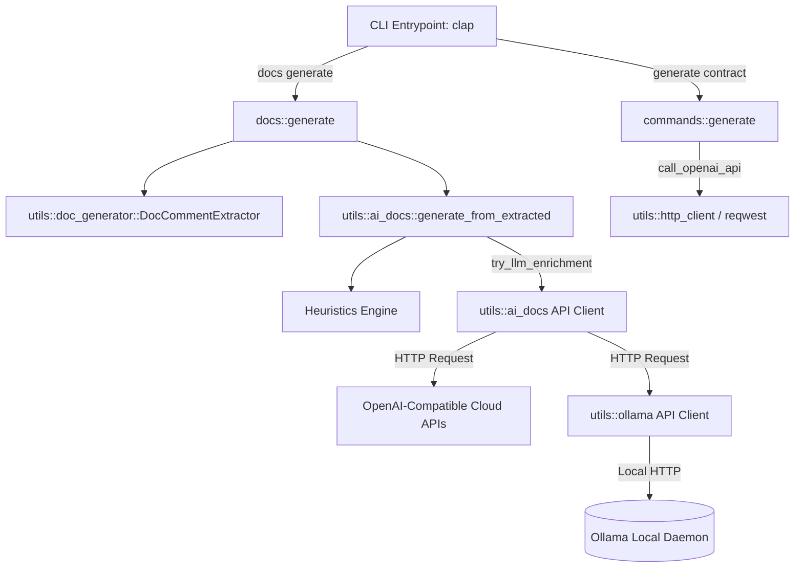
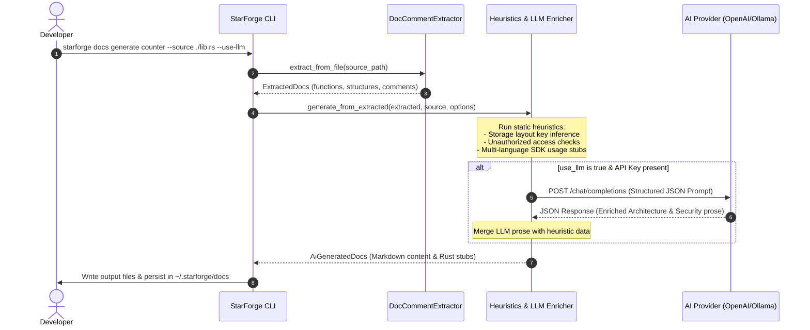
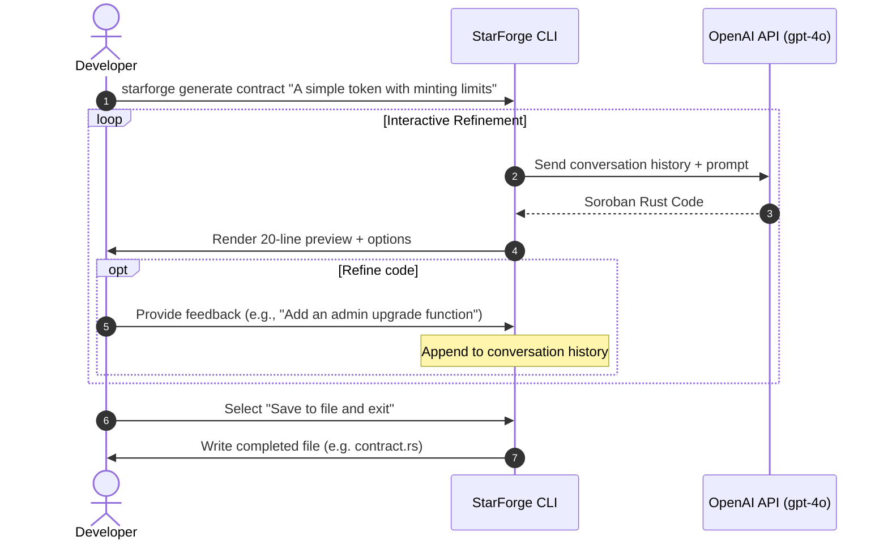

# StarForge AI Architecture Overview

This document details the system design, components, and interaction patterns for artificial intelligence features in StarForge.

## 1. Overview
StarForge uses artificial intelligence to assist Soroban smart contract developers in two primary workflows:
1. **AI-Assisted Documentation Generation (`starforge docs generate`)**: Combining source code analysis, rustdoc parsing, and heuristics with optional LLM enrichment to produce complete Markdown guides and rustdoc stubs.
2. **Natural Language Contract Generation (`starforge generate contract`)**: A CLI-based interactive agent that generates and refines Soroban-compatible Rust contract code using deep prompt engineering.

---

## 2. Component Architecture

The StarForge AI system is designed with a layered structure to separate parsing logic, CLI orchestration, and model invocation:

### Components Layer Description
*   **CLI Layer (`src/commands/`)**:
    *   `commands::generate`: Handles natural language prompt parameters, manages the interactive feedback/refinement loop with the developer, and writes code to the destination file.
*   **Orchestration / Parsing Layer (`src/utils/`)**:
    *   `utils::doc_generator::DocCommentExtractor`: Parses Rust source code to extract module-level documentation, structs, enums, functions, and existing docstrings without compiling the code.
    *   `utils::ai_docs`: Orchestrates the documentation generation pipeline. Combines raw ast-extracted docs with heuristics (e.g. auth-checks, common storage layout detection) and issues requests for LLM-based prose enrichment if configured.
*   **LLM Providers Layer (`src/utils/`)**:
    *   `utils::ollama`: Provides a local-first interface targeting a local Ollama server instance (by default `http://localhost:11434` running `codellama:7b`).
    *   **OpenAI-Compatible Client**: Located inside `ai_docs.rs` and `generate.rs`, communicating with OpenAI or custom endpoints (e.g. via `STARFORGE_AI_BASE_URL` and `STARFORGE_AI_API_KEY`).

---

## 3. Component Interactions

### A. Documentation Generation Sequence

The sequence diagram below shows how StarForge processes a contract file to produce enriched markdown documentation:

### B. Interactive Contract Generation

For contract generation, StarForge implements a refinement loop allowing developers to iterate on the generated smart contract before saving:

---

## 4. Key Design Decisions

1. **Hybrid Heuristic + LLM Design**:
   Because LLM calls are asynchronous, require internet or hardware resources, and can occasionally hallucinate, StarForge operates on a hybrid model. The CLI always performs fast static analysis (heuristics) first. The LLM only enriches prose sections (like the overview description and security summaries) without touching the verified ABI structure.
2. **Local-First Capabilities**:
   To preserve developer privacy and facilitate offline work, StarForge supports Ollama out of the box. The toolchain detects if `ollama` is installed on the user's path, runs health checks against `localhost:11434`, and guides the user to pull models like `codellama:7b` when needed.
3. **Structured Outputs**:
   To avoid parsing raw markdown text returned from LLMs (which is error-prone), LLM enrichment relies on structured output APIs. StarForge requests the LLM to respond in a strict JSON format with schema keys (`architecture`, `security`, `functions`), ensuring a reliable merge into the generated markdown structure.
4. **Interactive Iteration**:
   Rather than performing a single shot generation which may not suit specific design requirements, the contract generator preserves conversational context, allowing users to direct the model to fix issues, add traits, or adjust logic interactively.
