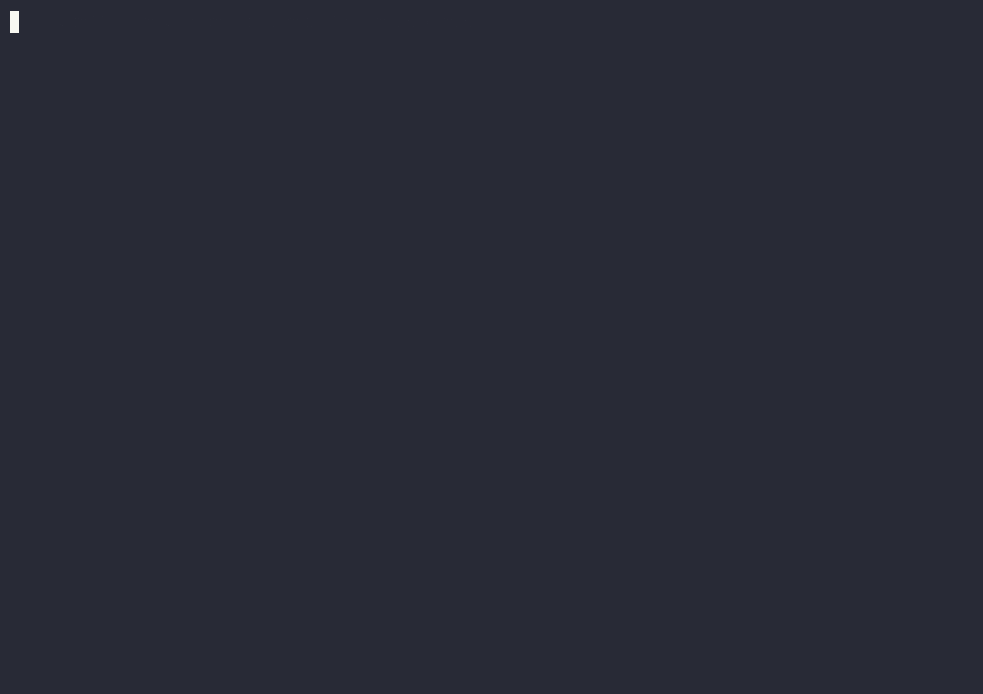

# StarForge

**Scaffold, deploy and operate Soroban smart contracts from one fast Rust CLI:
templates, encrypted wallets and deployment safety checks for Stellar.**

[](https://github.com/Nanle-code/StarForge/actions/workflows/ci.yml)


```bash norun
curl -fsSL https://raw.githubusercontent.com/Nanle-code/StarForge/master/install.sh | bash
```

macOS and Linux (x86\_64, aarch64). Windows `.zip`, checksums and
build-from-source: [installation guide](docs/INSTALL.md).



<sub>A real testnet run, recorded with [`scripts/record-demo.py`](scripts/record-demo.py)
([cast file](docs/assets/demo.cast)).</sub>

## 30-second tour

These commands run offline in a throwaway `HOME`, and CI executes them on
every PR:

```bash run
starforge new contract hello              # scaffold from a template
starforge wallet create alice             # local keypair (add --encrypt to protect it)
starforge network show                    # testnet, mainnet, or your own
starforge template search defi            # community templates
```

Then deploy to testnet. StarForge works alongside
[stellar-cli](https://developers.stellar.org/docs/tools/cli), which compiles the
contract and signs the final transactions:

```bash norun
cd hello && stellar contract build
stellar keys generate deployer                          # or reuse an existing identity
starforge wallet import --from-stellar-cli deployer     # same wallet, now in StarForge
starforge wallet fund deployer
starforge deploy --wasm target/wasm32v1-none/release/hello.wasm --wallet deployer --dry-run
starforge deploy --wasm target/wasm32v1-none/release/hello.wasm --wallet deployer --yes --execute
stellar contract invoke --id <CONTRACT_ID> --source deployer --network testnet -- hello --to Stellar
```

## Highlights

| | |
|---|---|
| **Scaffolding** | `hello-world`, `token`, `nft` and `voting` templates, a template marketplace, and Vite + React dApp frontends. See [Usage](docs/USAGE.md#scaffold-commands). |
| **Wallets** | Keys encrypted at rest (Argon2id + AES-256-GCM), BIP39, backups and recovery shares, Ledger/Trezor, import from stellar-cli. See [Usage](docs/USAGE.md#wallet-commands) and [wallet import security](docs/WALLET_IMPORT_SECURITY.md). |
| **Safe deploys** | WASM validation, balance and fee simulation, dry-run plans, deploy policies, checkpoints, history and rollback. See [Deploy policy](docs/DEPLOY_POLICY.md) and [checkpoints](docs/DEPLOYMENT_CHECKPOINTS.md). |
| **Automation** | A stable `--json` envelope, YAML invocation scripts with assertions, and non-interactive mode for CI. See [JSON stability](docs/CLI_JSON_STABILITY.md) and [Usage](docs/USAGE.md#repeatable-invocation-scripts). |
| **Local AI (optional)** | Audit, explain and test contracts with a local Ollama model. Nothing leaves your machine. See [Offline AI](docs/OFFLINE_AI.md). |

Coming from stellar-cli? Read
**[Migrating from stellar-cli](docs/MIGRATING_FROM_STELLAR_CLI.md)** for a
command-by-command mapping, how to import identities, and what stellar-cli
still does better.

## Documentation

- [Installation](docs/INSTALL.md) · [Usage guide](docs/USAGE.md) · [Command reference](docs/COMMAND_REFERENCE.md) · [Cheat sheet](docs/COMMAND_CHEATSHEET.md)
- [Configuration](docs/CONFIGURATION.md) · [Architecture](ARCHITECTURE.md) · [All documentation](docs/README.md)
- Docs site: <https://nanle-code.github.io/StarForge/> (built from [`docs/`](docs/))

## Status and stability

StarForge is **beta** (`0.x`). The core wallet, scaffold and deploy workflows
are covered by CI on Linux, macOS and Windows. Command names and flags can
still change between minor releases; breaking changes are listed in the
release notes. The `--json` output envelope is versioned and stable
([policy](docs/CLI_JSON_STABILITY.md)). Several advanced command groups
(AI-assisted tooling, orchestration, governance) are experimental.

## Security

- Report vulnerabilities privately: see [SECURITY.md](SECURITY.md).
- Trust boundaries and assumptions: [threat model](SECURITY_THREAT_MODEL.md).
- Install only from this repository. Releases ship with `SHA256SUMS.txt`, and
  the installer verifies it.
- Plaintext wallets are for testnet. Use `--encrypt` or a hardware wallet for
  real funds.
- Telemetry is **off by default** and local-only until you opt in
  ([details](TELEMETRY_PRIVACY.md)).

## Contributing

Contributions are welcome. Start with [CONTRIBUTING.md](CONTRIBUTING.md) and
the [quick reference](CONTRIBUTOR_QUICK_REFERENCE.md). CI runs formatting,
clippy, tests, canonical-link checks and the runnable docs examples
([annotation guide](CONTRIBUTING.md#documentation-snippets)).

StarForge takes part in the [Stellar Wave Program](https://www.drips.network/wave/stellar)
on Drips, where merged contributions earn rewards. Read the
[terms](https://docs.drips.network/wave/terms-and-rules) first.

## License

MIT. See [LICENSE](LICENSE).
